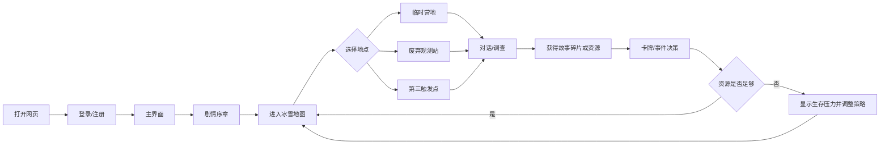

# 《雪线之外》网页游戏项目计划书

## 一、项目是什么

《雪线之外》是一款运行在浏览器中的冰雪题材生存探索游戏。玩家扮演在极端寒冷环境中求生的角色，沿地图探索废弃观测站、临时营地等地点，通过与 NPC 对话、调查场景和使用卡牌获取物资与故事碎片，逐步拼凑出完整剧情。

### 1.1 项目目标

1. 建立一个网页游戏原型。
2. 用冰雪像素画面和二次元剧情对话形成视觉叙事。
3. 验证地图探索、碎片化叙事、生存资源和基础卡牌机制。

### 1.2 交付物

| 交付物 | 内容 | 验收形式 |
|---|---|---|
| 可运行网页原型 | 登录页、主菜单/人物页、剧情页、地图页、事件或卡牌页 | 浏览器打开并完成主流程 |
| 地图与素材 | 冰雪地图、角色/场景图、卡牌背景、按钮与图标 | 页面正确加载，无明显错位 |
| 剧情与规则 | 主线、三个触发点、NPC 对话、基础卡牌/资源规则 | 文档与页面内容一致 |
| 项目文档 | README、项目计划、项目日志、使用说明 | GitHub 仓库可查阅 |
| 展示材料 | 小组介绍/宣传视频、演示流程 | 可在汇报时播放或现场演示 |

## 二、项目来源与背景

项目源于课程前期小组讨论。第一次会议围绕地图、剧情节点、卡牌玩法、网页原型规范和 Git 协作展开，已经确定了冰雪像素风、碎片化叙事和网页技术路线。仓库中已有登录页面、地图页面、贴图资源以及剧情文档，说明项目已经从想法进入原型实现阶段。


## 三、具体内容与功能结构

### 3.1 网站/游戏内容树状图

```text
《雪线之外》网页游戏
├── 登录与入口
│   ├── 登录
│   ├── 注册/身份信息
│   └── 进入游戏
├── 主界面
│   ├── 开始探索
│   ├── 人物卡牌
│   └── 项目/小组介绍
├── 剧情引导
│   ├── 序章对话
│   ├── NPC 对话框
│   └── 教学提示
├── 冰雪地图
│   ├── 临时营地
│   ├── 废弃观测站
│   ├── 第三个剧情触发点
│   ├── 可调查物件
│   └── 地点切换/返回
├── 生存与卡牌
│   ├── 物资：食物、子弹、火堆等
│   ├── 基础回合制 PVE 框架
│   ├── 事件卡牌
│   └── 卡牌结果反馈
└── 信息展示
    ├── 角色详情
    ├── 已获得故事碎片
    ├── 进度/状态
    └── 结束或继续探索
```

### 3.2 核心用户流程



### 3.3 功能细节

登录与注册 用户输入账号和密码后进入主界面。本阶段采用前端原型验证，数据可使用浏览器本地存储或演示用状态，不承诺真实账号系统。输入为空、格式错误时给出明确提示。

地图探索 地图以冰雪像素场景为主体，地点采用可点击区域或按钮标识。点击地点后进入对应事件，返回时保留当前探索状态。地图代码与资源路径分离，方便后续替换贴图。

剧情对话 对话框显示角色名、头像、正文和继续按钮；对话结束后进入调查或地点选择。NPC 对话承担世界观说明和线索提示。

碎片化叙事 每个剧情触发点至少提供一段 NPC 对话、一个可调查对象和一个可记录的故事碎片。碎片列表用于展示玩家已获得内容，最终把三个地点的信息串联起来。

基础卡牌与资源 先实现少量、规则清晰的卡牌，不在原型阶段扩张复杂牌组。卡牌可影响食物、子弹、火堆或故事线索；每次使用后在界面上显示结果，便于用户理解。具体数值由岑安乾，刘书宏在第二周前半段确定。


## 四、技术方案

| 项目 | 方案 |
|---|---|
| 开发环境 | Windows，Visual Studio Code |
| 代码托管 | GitHub 仓库 `anqiancen/pre-semester-project` |
| 前端结构 | HTML5 页面、CSS3 外部样式表、原生 JavaScript |
| 数据方式 | 原型阶段使用 JavaScript 内存状态或 `localStorage` |
| 发布方式 | GitHub 仓库直接预览，或使用静态网页服务器托管 |
| 图像资源 | PNG 等位图素材；地图贴图、角色图和界面图统一管理 |

## 五、角色分工

| 成员 | 主责 | 具体工作 | 交付节点 |
|---|---|---|---|
| 陈子琪 | 地图、美术资源、项目统筹 | 生成地图代码、整理冰雪贴图、提供角色/界面素材、设计卡牌界面、维护 README 和项目计划、协助统筹合并 | 第 1 周地图基础版；第 2 周素材和卡牌；第 3 周整合 |
| 岑安乾 | 登录与注册页面 | 完成登录/注册页面、输入校验、入口跳转、与主流程联调 | 第 1 周末完成入口 |
| 戢歆雅 | 剧情与宣传 | 剧情文本、NPC 对话、剧情节点、宣传视频剪辑与展示材料 | 第 1 周剧情框架；第 2 周节点内容；第 3 周视频定稿 |
| 陈曦然 | 剧情与关卡 | 与季新雅共同设计主线、三个触发点、调查内容和碎片化叙事逻辑 | 第 2 周前半段完成关卡稿 |
| 刘书宏 | 卡牌规则与测试 | 与陈子琪组织确定卡牌规则、物资消耗和事件反馈，参与可玩性测试 | 第 2 周前半段规则定稿 |


## 六、完整三周时间表

### 第 1 周：需求冻结与基础原型

| 工作内容 | 里程碑/验收 |
|---|---|
| 确认项目范围、页面清单、分工和 Git 提交规则；整理剧情主线、三个触发点和卡牌机制草案；完成登录页、地图原型、素材目录和基础对话；完成 README 初稿并进行首次联调。 | 登录入口、地图页面和剧情骨架可以打开并演示；第一版需求范围冻结。 |

### 第 2 周：功能实现与内容填充

| 工作内容 | 里程碑/验收 |
|---|---|
| 确定卡牌类型、资源数值和反馈规则；完成三个剧情触发点的 NPC 对话、调查对象和故事碎片；加入地点切换、事件状态、卡牌反馈、人物卡牌和诗词栏；完成全员体验测试。 | 至少 3 种卡牌可操作；三个剧情节点内容完整；主流程无明显断点；形成问题清单。 |

### 第 3 周：整合、质量控制与展示

| 工作内容 | 里程碑/验收 |
|---|---|
| 修复高优先级问题；统一字体、颜色、按钮、对话框和地图布局；进行桌面端、移动端和浏览器兼容性检查；补齐 README、项目计划和截图；完成宣传视频、演示路线、最终回归测试和仓库提交。| 核心流程可连续完成；视觉风格统一；验收清单完成；项目可从干净环境重新打开并演示。 |

## 七、进度与质量控制

### 7.1 进度

- 采用git：完成的代码和素材及时提交 GitHub。
- 每项任务必须有负责人、截止日和可验证结果
- 登录入口、地图主流程、剧情触发和卡牌反馈属于高优先级，装饰性内容在主流程稳定后再做。
- 第 1 周末冻结页面范围，第 2 周末冻结主要功能，第 3 周只做修复、统一和展示准备，避免临近提交时大幅改需求。

### 7.2 质量

| 检查类别 | 必检内容 | 通过标准 |
|---|---|---|
| 功能 | 登录、跳转、对话继续、地点触发、卡牌点击、返回 | 主流程连续完成，无死链 |
| 内容 | 人物名、地点名、剧情顺序和卡牌说明 | 无明显错别字，内容与设计稿一致 |
| 视觉 | 图片比例、文字可读性、按钮状态、地图布局 | 不遮挡、不溢出、风格统一 |
| 技术 | Console 报错、资源 404、文件路径、重复代码 | Console 无阻断性错误，资源全部加载 |
| 兼容 | Chrome/Edge、桌面宽度、移动宽度 | 关键功能均可使用 |
| 协作 | 提交记录、文件命名、README、版本备份 | 新成员按文档可运行项目 |


## 八、示例图与原型说明

仓库已有素材可作为计划书中的示例：`map ver 0.1/map1.html` 与 `map2.html` 展示地图原型，`winter_town.png`、`winter_beach.png` 和 `winter_outdoorsTileSheet.png` 可用于说明冰雪地图风格，`login/index.html` 可用于说明登录入口。最终 Word/PDF 版本会将这些页面/素材截图或示意图放入附录；如果当前环境无法渲染远程页面，则保留“页面名称 + 功能说明 + 预期画面”的线框示意，避免把尚未定稿的内容误称为最终截图。

### 8.1 页面线框示意

现有原型素材示例：


### 8.2 卡牌交互示意

```text
点击卡牌正面 ──翻转──> 角色头像/详情
       │                    │
       └──── 使用 ───────> 资源变化 + 故事反馈
```

## 九、风险与应对

| 风险 | 影响 | 应对措施 |
|---|---|---|
| 卡牌规则迟迟不能确定 | 阻塞开发 | 第 2 周前只保留 3 种基础卡牌，先实现接口和反馈 |
| 素材风格不一致或缺失 | 页面观感下降 | 第 1 周建立素材目录和尺寸规范，优先使用已有冰雪素材 |
| 成员时间冲突 | 任务延期 | 每项任务设置可交接文件；高优先级任务至少让一名成员了解状态 |
| 页面互相跳转失败 | 主流程中断 | 每次合并后执行入口到结尾的冒烟测试 |
| 外部资源无法加载 | 演示失败 | 关键图片放入仓库本地路径，避免依赖不稳定外链 |
| 需求不断增加 | 三周无法收尾 | 第 1 周冻结范围，新增需求排到第 3 周之后 |

## 十、预期成果与验收结论

三周结束时，项目应当能够在浏览器中从登录入口开始，依次完成剧情序章、进入冰雪地图、选择至少三个剧情地点、触发 NPC 对话、获得故事碎片、使用基础卡牌并查看人物/诗词内容。页面应有统一的冰雪主题，代码和素材结构清楚，仓库中保留项目计划、README、会议记录和可运行原型。

